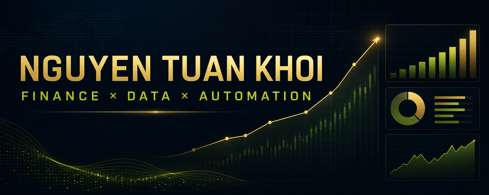

### Finance & Data Analytics · Power BI · AI Automation

I turn financial and operational data into controlled analysis, clear stories, and practical management action.

[Featured project](#featured-project) · [Experience proof](#experience-proof) · [Toolkit](#toolkit) · [Roadmap](#roadmap) · [Contact](#contact)

---

## Recruiter scan — 30 seconds

| | |
|---|---|
| **Current role** | Commission Analyst · Mantu Group |
| **Target direction** | FP&A · Finance BI · Financial/Data Analytics |
| **Core strengths** | P&L · Variance analysis · Power BI · Controls · AI automation |
| **Location** | Ho Chi Minh City, Vietnam |

## Featured project

### [Power BI Business Performance Dashboard →](https://github.com/TuanKhoi2411/power-bi-portfolio)

A decision-focused report that moves from executive P&L monitoring to performance drivers, segment contribution, and break-even analysis.

| 4 report pages | 73 visual containers | Downloadable PBIX |
|:---:|:---:|:---:|
| Overview · Breakdown · Segments · Breakeven | P&L · Revenue · Net profit · Opex · EBIT | Inspect the full interactive model |

**Decision flow:** Executive signal → Driver analysis → Segment contribution → Break-even action

[Read the complete case study](https://github.com/TuanKhoi2411/power-bi-portfolio) · [Download the Power BI report](https://github.com/TuanKhoi2411/power-bi-portfolio/raw/main/CP1_Nguyen%20Tuan%20Khoi_Redesign1.pbix)

## Experience proof

| Scope | Evidence |
|---|---|
| **Regional operations** | Lead commission closing cycles for **30+ managers** across SEA and Italy |
| **Financial responsibility** | Approximately **EUR 500K annual scope** |
| **Cross-functional control** | Partner with FP&A, HR, Data, and Product teams to validate results |
| **Automation at scale** | Designed two production AI agents supporting **100+ managers** |

## Toolkit

**Finance** — Budgeting & forecasting · P&L analysis · Financial modeling · Audit & reconciliation · Accounting controls

**Analytics** — Power BI · Power Query · Excel · SQL · Python · Data visualization

**Automation** — AI agents · Codex · Dust.tt · SharePoint-integrated workflows

## How I work

> **Business question → Controlled data → Clear analysis → Management action**

I value clarity over noise, visible controls over black boxes, and analysis that helps people make better decisions.

## Roadmap

Track active and upcoming work in my [Portfolio & Career Roadmap](https://github.com/users/TuanKhoi2411/projects/1).

Next case studies: finance reporting · AI policy Q&A · payment reconciliation audit · Python/SQL analytics.

## Contact

Open to conversations around FP&A, finance analytics, business intelligence, and practical AI automation.

[Personal portfolio](https://tuan-khoi-portfolio.roninoah155a2.chatgpt.site) · [LinkedIn](https://www.linkedin.com/in/tuan-khoi-nguyen) · [Email](mailto:tuankhoi24112003@gmail.com)

